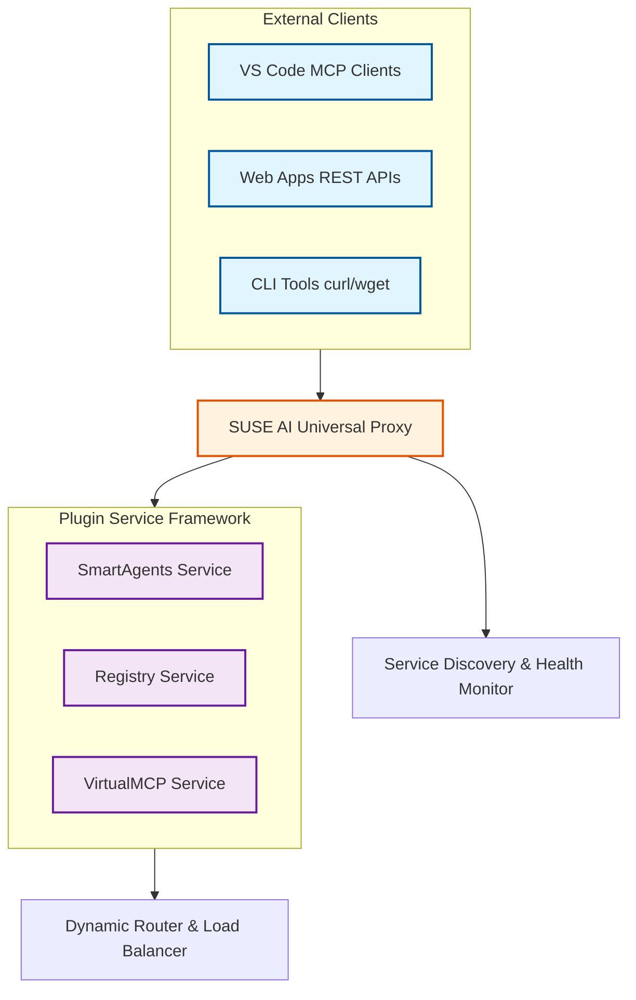

# SUSE AI Universal Proxy

A comprehensive platform for managing and proxying Model Context Protocol (MCP) servers, providing scalable AI service orchestration across multiple microservices.

## ✨ Key Features

- **Scalable Routing**: Session-aware load balancing and routing to MCP server instances
- **Lifecycle Management**: Automated deployment, scaling, and teardown of AI services
- **Registry Management**: Comprehensive MCP server registry with discovery, upload, and search capabilities
- **Enterprise Integration**: Built-in authentication, observability, and security features
- **Multi-Provider Support**: Seamless integration with various AI providers and local models
- **Kubernetes-Native**: Designed for cloud-native deployments with Helm charts and StatefulSets
- **Plugin Architecture**: Extensible microservices framework for pluggable AI capabilities

## 🎯 What This Solves

The SUSE AI Universal Proxy addresses the growing complexity of deploying and managing AI services in enterprise environments. By providing a unified reverse proxy and management layer for MCP servers, it enables:

- **Unified API Gateway**: Single entry point for all AI services
- **Service Orchestration**: Automated service discovery and registration
- **Load Balancing**: Intelligent routing with session affinity
- **Security**: Enterprise-grade authentication and authorization
- **Observability**: Comprehensive monitoring and logging
- **Scalability**: Kubernetes-native deployment with auto-scaling

This solution bridges the gap between AI development and production deployment, making it easier to build and maintain AI-powered applications.

## 🏗️ Architecture Overview



## 🏗️ User Flow Architecture

```mermaid
graph LR
    A[User Device<br/>VS Code, Web App, CLI Tool] --> B[Proxy Service<br/>Router & Load Balancer<br/>• Service Discovery<br/>• Health Monitoring<br/>• Load Balancing<br/>• Session Affinity]
    B --> C[SmartAgents Service<br/>AI Orchestrator<br/>• Local Model acts on behalf<br/>of Remote LLM for security]
    B --> D[MCP Registry Service<br/>Server Management<br/>• Discovery<br/>• Upload<br/>• Search<br/>• Bulk Operations]
    D --> E[Network Scan<br/>Auto-Discovery<br/>• CIDR Scanning<br/>• Port Scanning<br/>• Health Checks<br/>• Auto-Registration]
    D --> F[VirtualMCP Service<br/>Legacy Integration<br/>• OpenAPI Schema<br/>• Database Integration<br/>• Code-free Generation<br/>• Legacy API Consumption]
    C --> G[Local Model<br/>Worker<br/>• Private Data Control]
    G --> H[Remote LLM<br/>Supervisor<br/>• Cloud AI Power]
    F --> I[MCP Servers<br/>Generated from APIs<br/>• Standardized Endpoints]

    classDef userClass fill:#e1f5fe,stroke:#01579b,stroke-width:2px
    classDef proxyClass fill:#fff3e0,stroke:#e65100,stroke-width:2px
    classDef serviceClass fill:#f3e5f5,stroke:#6a1b9a,stroke-width:2px
    classDef aiClass fill:#e8f5e8,stroke:#2e7d32,stroke-width:2px
    classDef outputClass fill:#fce4ec,stroke:#c2185b,stroke-width:2px

    class A userClass
    class B proxyClass
    class C,D,E,F serviceClass
    class G,H aiClass
    class I outputClass
```



## 📦 Services

### 🔀 Proxy Service
The core reverse proxy and management layer for MCP servers. Handles routing, discovery, and lifecycle operations.

- **[Overview](docs/overview.md)** - Architecture and key concepts
- **[Getting Started](docs/getting-started.md)** - Installation and setup
- **[API Reference](docs/api-reference.md)** - Complete API documentation
- **[Examples](docs/examples.md)** - Usage examples and tutorials
- **[Security](docs/security.md)** - Security features and best practices
- **[OAuth Implementation](docs/oauth-implementation.md)** - OAuth 2.1 compliant token management

### 🤖 Smart Agents Service
AI orchestrator to enable a local model to act on behalf of a remote LLM to provide more security while maintaining full control over the data.

*Note: SmartAgents has been moved to a separate repository for independent development.*

### 🔧 Virtual MCP Service
Virtual MCP allow the creation of an MCP Server starting from openapi schemas and databases without having to write code. Virtual MCP standardize the way endpoints are presented and allow legacy applications to be consumed by the LLM.

*Note: VirtualMCP has been moved to a separate repository for independent development.*

### 📚 MCP Registry
Comprehensive MCP server registry with discovery, deployment, and management capabilities.

- **[Registry Documentation](docs/registry.md)** - Complete registry guide

## 📚 Documentation

- **[Documentation Index](docs/index.html)** - Navigate complete documentation
- **[OAuth Implementation](docs/oauth-implementation.md)** - OAuth 2.1 compliant token management system
- **[Adapters Guide](docs/adapters.md)** - Adapter configuration and management
- **[Discovery Service](docs/discovery.md)** - Network discovery and auto-registration
- **[Registry Management](docs/registry.md)** - MCP server registry operations
- **[Contributing](CONTRIBUTING.md)** - Development guidelines and contribution process
- **[License](LICENSE.md)** - Apache 2.0 license information

### Local Development Setup
```bash
# 1. Start the proxy service
cd suse-ai-up-proxy && go run cmd/service/main.go

# 2. Start SmartAgents with proxy registration (now in separate repository)

# 3. Test the setup
curl http://localhost:8911/api/v1/plugins/services
curl http://localhost:8911/api/v1/models
```

## 🤝 Contributing

We welcome contributions! Please see our [Contributing Guide](CONTRIBUTING.md) for details on:

- How to get started with development
- Testing guidelines
- Submitting pull requests
- Coding conventions

For questions or discussions, join our [GitHub Discussions](https://github.com/suse/suse-ai-up/discussions).

## 📄 License

This project is licensed under the Apache License 2.0 - see the [LICENSE](LICENSE.md) file for details.

---

**Ideator and Author**: [@alessandro-festa](https://github.com/alessandro-festa)

Built with ❤️ by SUSE AI Team